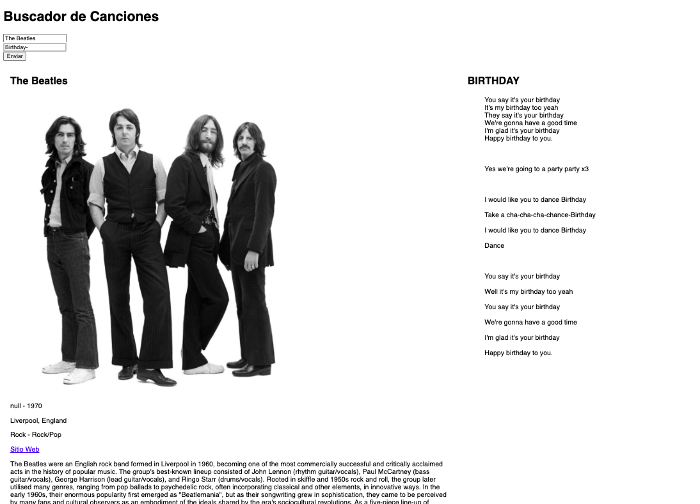

# BUSCADOR MUSICAL #

Utilizando [API TheAudioDB](https://www.theaudiodb.com/api_guide.php) y [API Lyrics.ovh](https://lyricsovh.docs.apiary.io/#) podemos buscar una cancion de un artista y que nos
devuelva la letra y una pequeña biografia del mismo.

Ejercicio propuesto por [JonMircha](https://jonmircha.com/) en su curso ["Aprendiendo Javascript"](https://www.youtube.com/playlist?list=PLvq-jIkSeTUZ6QgYYO3MwG9EMqC-KoLXA)

Podes verla online [ACA](https://axdny.github.io/Buscador-Musical/)

## Lenguajes utilizados ##
* HTML
* CSS
* Javascript
